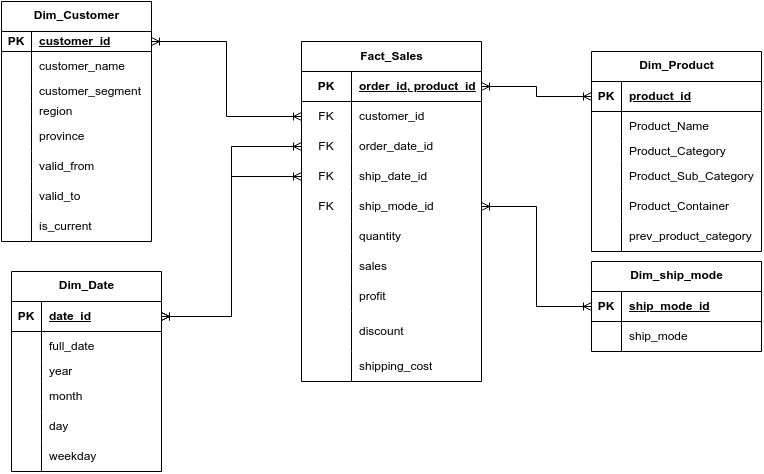

# 🚀 Data Engineering Pipeline (Airflow + dbt + PostgreSQL)

## 📌 Project Overview

This project implements a production-style **batch data pipeline** using modern data engineering tools.

It simulates a real-world Data Warehouse (DWH) pipeline with:

- workflow orchestration using Airflow
- SQL-based transformations via dbt
- incremental data loading
- dimensional modeling (fact & dimension tables)
- data quality checks

The pipeline processes sales data and builds a structured **analytics-ready Data Warehouse**.

---

## 🏗️ Architecture



    CSV (Raw Data)
           ↓
    Python Ingestion (Airflow)
           ↓
    Staging Layer (Postgres)
           ↓
    dbt Transformations
    (stg → marts → fact/dim)
           ↓
    Analytics Tables


---

## 🧰 Tech Stack

- Python
- PostgreSQL
- Apache Airflow
- dbt (Data Build Tool)
- pandas
- psycopg2
- YAML
- Git

---


## 📂 Project Structure
```
.
├── dags/
│ ├── sales_etl_superstore.py # ingestion (extract + load)
│ └── sales_dwh_pipeline.py # dbt orchestration
│
├── load/
│ └── load_to_postgres.py # loading logic
│
├── sales_dwh/ # dbt project
│ ├── models/
│ ├── macros/
│ ├── dbt_project.yml
│
├── data/
│ ├── raw/
│ └── processed/
│
├── sql/
│ ├── ddl/
│ └── debugging/
│
├── config.yaml
├── requirements.txt
└── README.md
```
---

## 🔄 Pipeline Workflow

### 1. Ingestion (Python + Airflow)

- Downloads CSV data
- Loads data into PostgreSQL staging tables

### 2. Transform (dbt)

- Builds staging models (`stg_sales`)
- Creates dimensional models:
  - `dim_customer` (SCD Type 2)
  - `dim_product`
- Builds fact table:
  - `fact_sales` (incremental)

### 3. Orchestration (Airflow)

Airflow schedules and executes:

- ingestion DAG
- dbt transformations
- dbt tests

---

## ⚡ Incremental Loading

The pipeline uses an **incremental strategy based on `updated_at`**:

- only new or updated records are processed
- avoids full table rebuilds
- ensures efficient execution

---
## 🔄 Evolution: From ETL to Modern ELT
Initially, the pipeline was implemented as a traditional ETL process using SQL scripts orchestrated in Airflow:
```
load_staging → scd2_update → scd2_insert → dim_product → dim_ship_mode → load_fact
```

This approach worked but had several limitations:

- transformation logic was scattered across multiple SQL files
- difficult to maintain and scale
- limited testing capabilities
- tightly coupled pipeline logic

---

### 🚀 Refactored Approach

The pipeline was redesigned using **dbt (ELT approach)**:

- transformations moved to dbt models
- modular structure (staging → marts)
- built-in testing (not_null, unique, relationships)
- support for incremental models

---

### 📊 Before vs After

| Metric | Before | After |
|------|--------|------|
| Staging rows | 797 | 8407 |
| Fact rows | 8402 | 8407 |
| Dim Customer | 799 | 1316 |

---

### 🧠 Key Improvements

- incremental processing instead of full reloads  
- improved maintainability and readability  
- better data quality validation  
- clear separation of ingestion and transformation  

---

### 🔥 SCD Type 2

The project implements Slowly Changing Dimension Type 2:

- historical changes are preserved  
- only one active record per customer (`is_current = TRUE`)  
- previous versions are closed using `valid_to`  

Example: customer changes create multiple historical records instead of overwriting data

## ✅ Data Quality

Implemented using dbt tests:

- not null checks
- uniqueness constraints
- relationships (foreign keys)

---

## ▶️ How to Run

1. Install dependencies

```bash
pip install -r requirements.txt
```
2. Run dbt
```bash
cd sales_dwh
dbt run
dbt test
```
3. Run Airflow DAG
```bash
airflow dags trigger sales_dwh_pipeline
```
🎯 Key Features
- Modular pipeline design
- Idempotent data loading
- Incremental data processing
- Scalable transformations with dbt
- Clear separation of concerns (ingestion vs transformation)
- Production-style architecture

🚀 Future Improvements
- add CI/CD (GitHub Actions)
- implement dbt snapshots (SCD2 via dbt)
- add monitoring & alerts
- move to cloud (BigQuery / Snowflake)